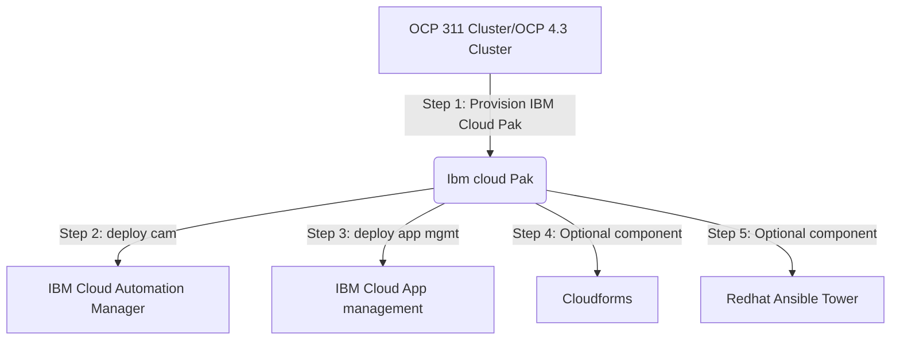

```mermaid
graph TD
A[OCP 311 Cluster/OCP 4.3 Cluster] -->|Step 1: Provision IBM Cloud Pak| B(Ibm cloud Pak)
B --> |Step 2: deploy cam|C[IBM Cloud Automation Manager]
B -->|Step 3: deploy  app mgmt|D[IBM Cloud App management]
B -->|Step 4: Optional component| G[Cloudforms]
B -->|Step 5: Optional component| H[Redhat Ansible Tower]
```
